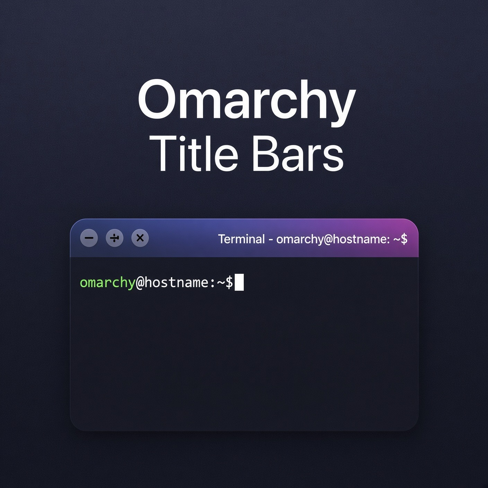
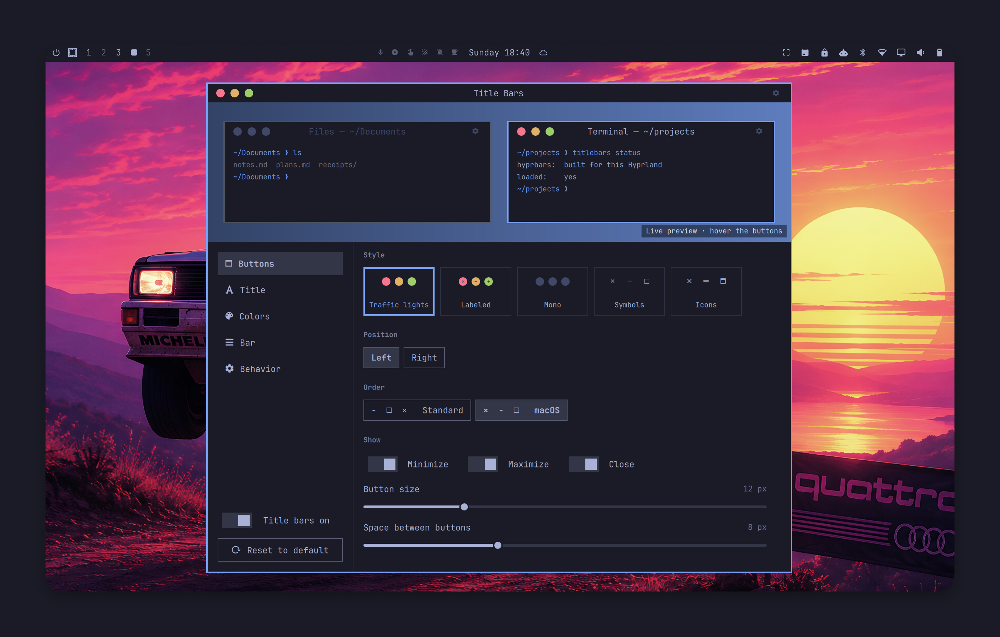
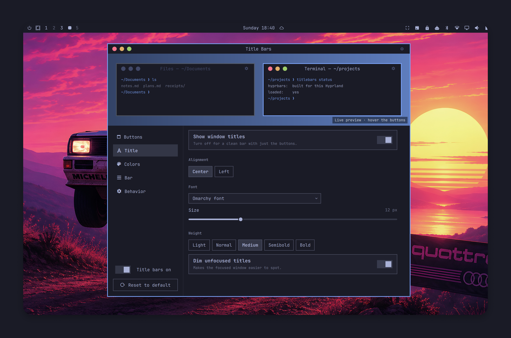
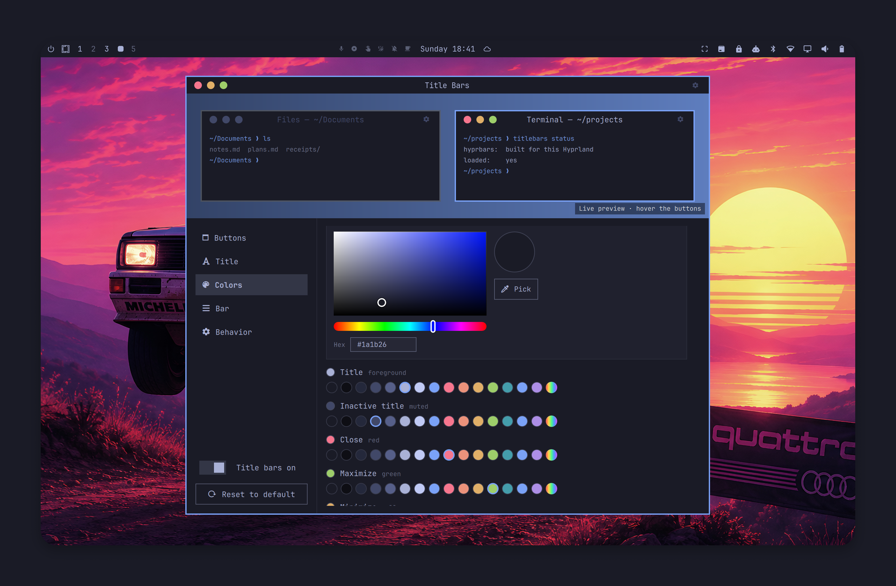
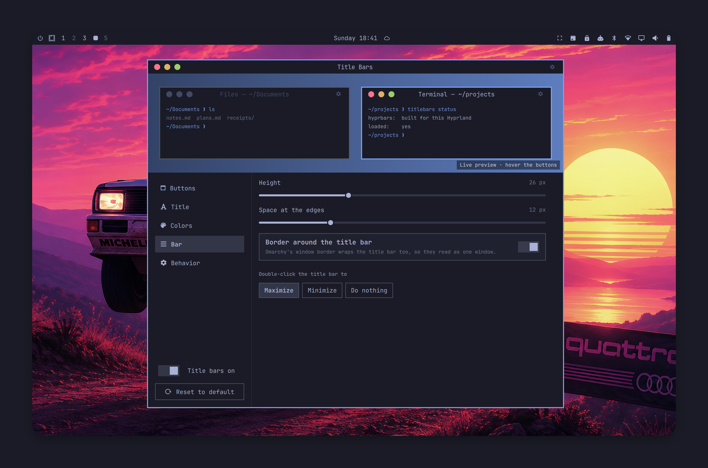
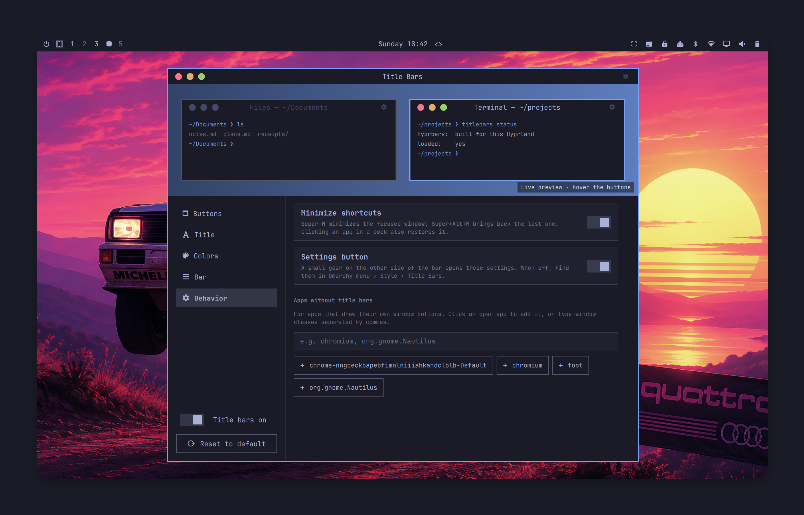

# Title Bars for Omarchy

Window title bars with minimize, maximize, and close buttons that match your Omarchy theme.



Title Bars draws the bars with [hyprbars](https://github.com/hyprwm/hyprland-plugins/tree/main/hyprbars)
from the official Hyprland plugins repo, which ships inside this plugin and is
built on your machine for your exact Hyprland version. The bars are styled from
your current Omarchy theme. A settings panel with a
live preview changes everything without touching config files.

* Five button styles: traffic lights, labeled, mono, symbols, and Nerd Font icons.
* Buttons on the left or right, in standard (− □ ×) or macOS (× − □) order. Hide any of them.
* Titles on or off, with alignment, font, size, weight, and dimmed titles on unfocused windows.
* Colors follow the theme, or pick your own: theme swatches, a color picker, or an
  eyedropper for anything on screen.
* Minimize sends a window to a hidden workspace. Clicking it in a dock, Alt+Tab,
  or Super+Alt+M brings it back.
* A small gear on the opposite side of the bar opens the settings. Turn it off
  and they're still in **Style › Title Bars**.
* Reset to the default look any time.

## Screenshots

**Buttons:** five styles, left or right, standard or macOS order.



**Title:** show or hide it, alignment, font, size, weight.



**Colors:** follow the theme, or pick from theme swatches, a color picker, or anywhere on screen.



**Bar:** height, edge spacing, border, and double-click action.



**Behavior:** minimize shortcuts, the settings gear, and apps without title bars.



## Install

```bash
omarchy plugin add https://github.com/marcho78/omarchy-titlebars.git --enable
```

The Title Bars panel opens once after install. Click **Set up title bars**:
it compiles hyprbars for your Hyprland version (a minute or two, nothing is
downloaded), adds `require("hypr.titlebars")` to `~/.config/hypr/hyprland.lua`,
adds **Style › Title Bars** to the Omarchy menu, and links the `titlebars`
command into `~/.local/bin`.

Building needs a C++ compiler and pkg-config (`base-devel`) and the Hyprland
headers (part of the `hyprland` package), all standard on Omarchy. Setup can
also run from a terminal, and is safe to repeat:

```bash
~/.config/omarchy/plugins/marcho78.titlebars/bin/titlebars setup
```

## Customize

Open **Omarchy menu › Style › Title Bars**, or run `titlebars settings`. Changes
apply as you make them. The same settings work from a terminal:

```bash
titlebars set buttons left
titlebars set style nerd
titlebars set title off
titlebars set colors.close "#ff5555"
titlebars reset
```

| Setting | Default | Values |
|---|---|---|
| `style` | `dots` | `dots`, `labeled`, `mono`, `symbols`, `nerd` |
| `buttons` | `right` | `right`, `left` |
| `order` | `standard` | `standard` (− □ ×), `mac` (× − □) |
| `showMinimize`, `showMaximize`, `showClose` | `true` | `on`, `off` |
| `buttonSize` | `12` | 8–24 |
| `buttonSpacing` | `8` | 0–24 |
| `title` | `true` | `on`, `off` |
| `titleAlign` | `center` | `center`, `left` |
| `titleFont` | Omarchy font | any installed font family |
| `titleSize` | `12` | 8–24 |
| `titleWeight` | `medium` | `light`, `normal`, `medium`, `semibold`, `bold` |
| `dimInactive` | `true` | `on`, `off` |
| `barHeight` | `26` | 16–48 |
| `barPadding` | `12` | 0–48 |
| `borderAroundBar` | `true` | `on`, `off` |
| `doubleClick` | `maximize` | `maximize`, `minimize`, `none` |
| `followTheme` | `true` | `on`, `off` |
| `colors.bar`, `.title`, `.titleInactive`, `.close`, `.maximize`, `.minimize`, `.icon`, `.inactiveButton` | theme colors | a `colors.toml` name (`red`, `accent`, ...) or `#rrggbb` / `#rrggbbaa` |
| `noBarApps` | none | window classes, comma separated |
| `shortcuts` | `true` | `on`, `off` (Super+M / Super+Alt+M) |
| `settingsButton` | `true` | `on`, `off` (a gear on the far side of the bar that opens these settings) |
| `enabled` | `true` | `on`, `off` |

Your choices are saved in `~/.config/omarchy/titlebars.json`, which only keeps
what differs from `defaults.json`. Custom colors apply while `followTheme` is off;
picking a color in the panel turns it off for you.

## Minimize

Hyprland has no minimized state, so Title Bars moves minimized windows to a
hidden special workspace. Activating one again brings it back to the workspace
you are on: click it in a dock, Alt+Tab to it, launch it with its shortcut, or
press Super+Alt+M for the last one you minimized.

## Hyprland updates

Hyprland plugins must match the running Hyprland exactly. Each Title Bars
release lists the Hyprland releases its bundled hyprbars supports
(`hypr/pins.json`). Setup installs a post-update hook, so `omarchy update`
rebuilds hyprbars when Hyprland changes, and the new build loads at your next
login.

When Hyprland moves to a release this version of Title Bars doesn't list yet,
nothing is built. The previous build keeps working until you log out, and the
panel asks you to update the plugin (`omarchy plugin update marcho78.titlebars`).

## Uninstall

```bash
titlebars uninstall            # unhook from Hyprland, keep your settings
titlebars uninstall --purge    # also delete your settings and the hyprbars build
omarchy plugin remove marcho78.titlebars
```

## Security

Title Bars runs as unsandboxed code in the Omarchy shell and adds a compiled
plugin to Hyprland, so here is exactly what it does.

**No network.** Nothing is ever downloaded. hyprbars ships in
`third_party/hyprbars/` (upstream commit and SHA-256 of every file in
`UPSTREAM.md`, BSD 3-Clause license alongside). Building copies those files
into a fresh private directory and compiles them with `/usr/bin/g++` directly,
using flags from `/usr/bin/pkg-config`: no make, no shell, no downloaded
toolchain. Only Hyprland releases listed in `hypr/pins.json` are built.

**Programs.** Everything runs by absolute path with an argument list, never
through a shell: `/usr/bin/g++`, `/usr/bin/pkg-config`, `/usr/bin/hyprctl`,
`/usr/bin/omarchy`, `/usr/bin/omarchy-shell`, `/usr/bin/fc-list`,
`/usr/bin/hyprpicker`, `/usr/bin/setsid`, `/usr/bin/kill`, `/usr/bin/timeout`,
and `/usr/bin/python3 -I` for `bin/titlebars`. Each gets a fixed minimal
environment (`PATH=/usr/bin`), runs in its own process group, and has a byte
budget on its output and a deadline, checked while it runs; going over either
kills the whole group. Nothing asks for root. The title bar buttons are fixed
`/usr/bin/hyprctl dispatch` commands that Hyprland runs; no setting reaches them.

**Files.** Everything under your home is read and written by `bin/titlebars`,
through directories opened one component at a time without following
symlinks. Each directory must be owned by you and not writable by others;
each file must be a regular file you own, with a single link, under a size cap.
Writes go to a random temp file in the same directory and are renamed into
place. The panel reads and writes nothing itself: it asks `bin/titlebars`,
whose output it reads in capped chunks. Hyprland does the same: its Lua module
gets validated settings from `bin/titlebars hypr` under a three-second limit and
a byte cap, so no file can stall the compositor. Title Bars writes only:

| Path | What |
|---|---|
| `~/.config/omarchy/titlebars.json` | your settings, only what differs from the defaults |
| `~/.local/share/hyprbars/` | the built `hyprbars.so` and a record of what it was built from |
| `~/.local/state/titlebars/setup-offered` | marks that the panel has offered setup once |
| `~/.config/hypr/titlebars.lua` | a loader for `hypr/titlebars.lua` |
| `~/.config/hypr/hyprland.lua` | one `require("hypr.titlebars")` line (with a timestamped backup) |
| `~/.config/omarchy/hooks/post-update.d/titlebars.hook` | the rebuild hook |
| `~/.config/omarchy/extensions/omarchy-menu.jsonc` | the Style › Title Bars entry |
| `~/.local/bin/titlebars` | a link to `bin/titlebars`, never replacing a file that isn't ours |

**Input and text.** Settings are validated against `schema.json` (types,
choices, ranges, string lengths and characters) by `bin/titlebars` before they
are stored or used. Every text element in the panel is `Text.PlainText`, and
window classes and font names shown in it are filtered to plain characters.

**Limits.** Anything running as your user can replace
`~/.local/share/hyprbars/hyprbars.so` or edit your Hyprland config directly;
Title Bars doesn't try to defend against that.

## Development

`lua tests/hypr.test.lua` runs the Hyprland module against a fake Hyprland API.
`python3 tests/cli.test.py` checks `bin/titlebars`: validation, refusal of
symlinked, oversized, or shared files, setup and uninstall edits, pinning, and
process limits.
`node tests/styles.test.cjs` checks that the panel preview draws exactly what
Hyprland will.

A checkout symlinked into `~/.config/omarchy/plugins/` doesn't hot-reload,
because the shell only watches that folder. Run `omarchy restart shell` after
changing QML.

## Credits

hyprbars is by Vaxry and the Hyprland contributors, BSD 3-Clause
(`third_party/hyprbars/LICENSE`). Title Bars ships it with one change,
`third_party/hyprbars/opposite-side-buttons.patch`, which lets the settings gear
sit on the other side of the bar.
