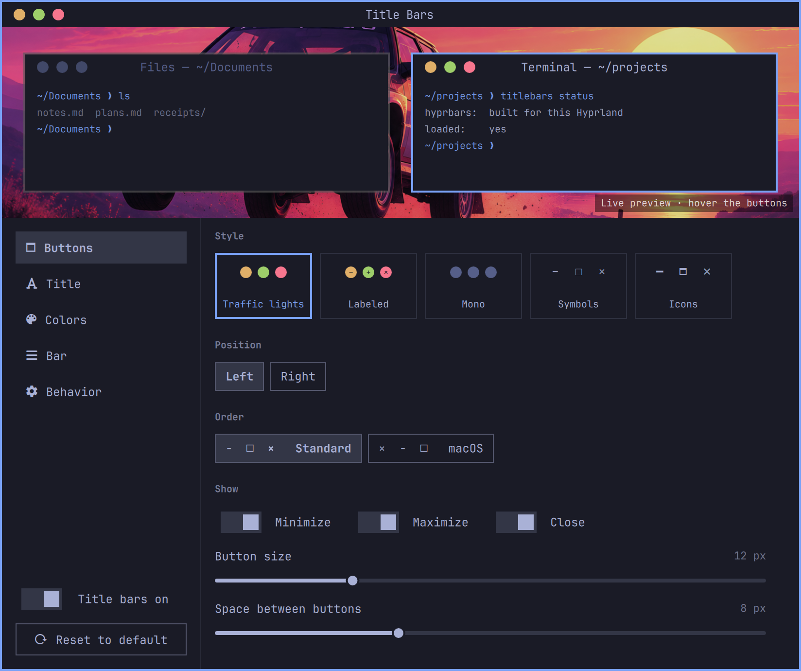

# Title Bars for Omarchy

Window title bars with minimize, maximize, and close buttons that match your Omarchy theme.



Title Bars draws the bars with [hyprbars](https://github.com/hyprwm/hyprland-plugins/tree/main/hyprbars)
from the official Hyprland plugins repo, builds it for your exact Hyprland
version, and styles it from your current Omarchy theme. A settings panel with a
live preview changes everything without touching config files.

* Five button styles: traffic lights, labeled, mono, symbols, and Nerd Font icons.
* Buttons on the left or right, in standard (− □ ×) or macOS (× − □) order. Hide any of them.
* Titles on or off, with alignment, font, size, weight, and dimmed titles on unfocused windows.
* Colors follow the theme, or pick your own: theme swatches, a color picker, or an
  eyedropper for anything on screen.
* Minimize sends a window to a hidden workspace. Clicking it in a dock, Alt+Tab,
  or Super+Alt+M brings it back.
* A small gear on the opposite side of the bar opens the settings. Turn it off
  and they're still in **Style › Title Bars**.
* Reset to the default look any time.

## Install

Title Bars compiles hyprbars, so it needs the Hyprland headers (part of the
`hyprland` package) and a compiler (`base-devel`), both standard on Omarchy.

```bash
omarchy plugin add https://github.com/marcho78/omarchy-titlebars.git --enable
~/.config/omarchy/plugins/marcho78.titlebars/bin/titlebars setup
```

Setup builds hyprbars for your Hyprland version (a minute or two), adds
`require("hypr.titlebars")` to `~/.config/hypr/hyprland.lua`, adds
**Style › Title Bars** to the Omarchy menu, and links the `titlebars` command
into `~/.local/bin`. It is safe to run again.

## Customize

Open **Omarchy menu › Style › Title Bars**, or run `titlebars settings`. Changes
apply as you make them. The same settings work from a terminal:

```bash
titlebars set buttons left
titlebars set style nerd
titlebars set title off
titlebars set colors.close "#ff5555"
titlebars reset
```

| Setting | Default | Values |
|---|---|---|
| `style` | `dots` | `dots`, `labeled`, `mono`, `symbols`, `nerd` |
| `buttons` | `right` | `right`, `left` |
| `order` | `standard` | `standard` (− □ ×), `mac` (× − □) |
| `showMinimize`, `showMaximize`, `showClose` | `true` | `on`, `off` |
| `buttonSize` | `12` | 8–24 |
| `buttonSpacing` | `8` | 0–24 |
| `title` | `true` | `on`, `off` |
| `titleAlign` | `center` | `center`, `left` |
| `titleFont` | Omarchy font | any installed font family |
| `titleSize` | `12` | 8–24 |
| `titleWeight` | `medium` | `light`, `normal`, `medium`, `semibold`, `bold` |
| `dimInactive` | `true` | `on`, `off` |
| `barHeight` | `26` | 16–48 |
| `barPadding` | `12` | 0–48 |
| `borderAroundBar` | `true` | `on`, `off` |
| `doubleClick` | `maximize` | `maximize`, `minimize`, `none` |
| `followTheme` | `true` | `on`, `off` |
| `colors.bar`, `.title`, `.titleInactive`, `.close`, `.maximize`, `.minimize`, `.icon`, `.inactiveButton` | theme colors | a `colors.toml` name (`red`, `accent`, ...) or `#rrggbb` / `#rrggbbaa` |
| `noBarApps` | none | window classes, comma separated |
| `shortcuts` | `true` | `on`, `off` (Super+M / Super+Alt+M) |
| `settingsButton` | `true` | `on`, `off` (a gear on the far side of the bar that opens these settings) |
| `enabled` | `true` | `on`, `off` |

Your choices are saved in `~/.config/omarchy/titlebars.json`, which only keeps
what differs from `defaults.json`. Custom colors apply while `followTheme` is off;
picking a color in the panel turns it off for you.

## Minimize

Hyprland has no minimized state, so Title Bars moves minimized windows to a
hidden special workspace. Activating one again brings it back to the workspace
you are on: click it in a dock, Alt+Tab to it, launch it with its shortcut, or
press Super+Alt+M for the last one you minimized.

## Hyprland updates

Hyprland plugins must match the running Hyprland exactly. Setup installs a
post-update hook, so `omarchy update` rebuilds hyprbars whenever Hyprland
changes, and the new build loads at your next login. If a brand-new Hyprland
release isn't supported upstream yet, the build fails and keeps the previous
plugin; Hyprland shows a notice and `titlebars build --force` tries again later.

## Uninstall

```bash
titlebars uninstall            # unhook from Hyprland, keep your settings
titlebars uninstall --purge    # also delete your settings and the hyprbars build
omarchy plugin remove marcho78.titlebars
```

## Development

`lua tests/hypr.test.lua` runs the Hyprland module against a fake Hyprland API.
`node tests/styles.test.cjs` checks that the panel preview draws exactly what
Hyprland will.

A checkout symlinked into `~/.config/omarchy/plugins/` doesn't hot-reload,
because the shell only watches that folder. Run `omarchy restart shell` after
changing QML.

## Credits

hyprbars is by Vaxry and the Hyprland contributors, BSD 3-Clause. Title Bars
clones and builds it on your machine; it doesn't ship its code.

hyprbars puts every button on one side, so Title Bars applies a small patch
(`hypr/hyprbars-opposite.patch`) at build time to place the gear on the other
side. If a future hyprbars no longer takes the patch, the build goes ahead
without it and the gear stays hidden.
